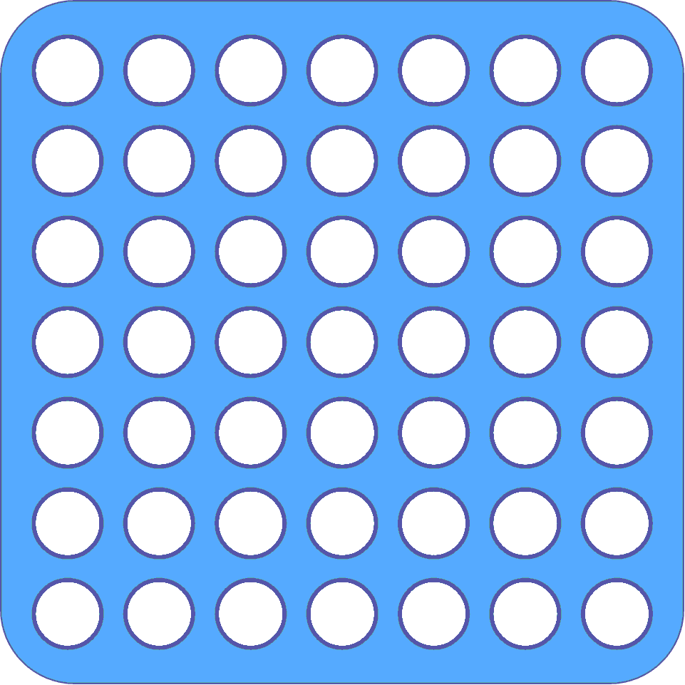

# Connect4
In this project, I explore reinforcement learning to train a neural network to play Connect 4 against a simple rule-based opponent.

Connect 4 is a classic two-player game where players take turns dropping tokens into a 7x7 grid. The goal is to be the first to align four of your tokens horizontally, vertically, or diagonally. The game ends when a player wins or the board is completely filled.
  
    

 
     
 
 <i>Game board and tokens</i> 

The project consists of two main components:  

  🎮 A graphical game interface built using PyGame  
  🧠 A reinforcement learning agent trained with PyTorch  

## Rule based agent
To challenge the learning agent, I implemented a rule-based opponent with four levels of increasing intelligence. Each level adds an additional layer of strategic behavior:
| Agent level | Behavior |
| ----------- | -------  |
| 0           | Agent selects columns at random |
| 1           | Agent prioritizes token stacking if 2 tokens are alread aligned |
| 2           | Agent checks if any stack will result in winning (3 tokens aligned) |
| 3           | Agent tries to block opponents winning moves |

## Reinforcement learning approach
The learning agent is trained using Q-learning approach that predicts the value of possible actions in each game state.

To stabilize and accelerate training, I use the following techniques:

**Curriculum learning**: The agent starts by learning against the simplest opponent (Level 0), and gradually progresses to more advanced ones. This step-by-step ramp-up helps avoid overwhelming the agent early in training.

**Soft target network updates**: Instead of copying the Q-network to the target network every N steps, I apply a soft update at every step. This blends the weights of the target and current networks slowly, preventing large oscillations during learning and helping to stabilize convergence.
